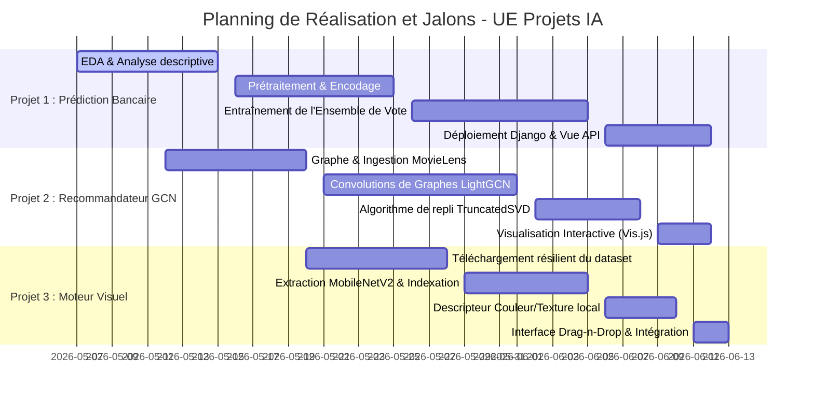

# Rapport Global d'Avancement et Méthodes de Travail
### UE : Projets d'Intelligence Artificielle (AIA) — ENSPY
**Date de soumission : 13 Juin 2026**  
**Période d'évaluation : 7 Mai 2026 au 13 Juin 2026**

---

## 1. Introduction et Synthèse de Réalisation
Ce rapport présente la démarche d'ingénierie et de recherche menée pour concevoir, entraîner et déployer trois systèmes d'intelligence artificielle distincts :
1. **Prédiction du comportement des clients (Bank Behavior Prediction)**
2. **Système de recommandation basé sur les graphes (Movie Recommender)**
3. **Moteur de recherche visuel de vêtements (Visual Search Engine)**

Chaque projet a été structuré sous forme d'une application modulaire Django dotée d'une interface web moderne (Tailwind CSS, Outfit Typography) et d'un notebook d'analyse exploratoire éducatif complet.

### Liens GitHub et Production :
*   **GitHub Project Board (Backlog & Progression)** : [https://github.com/users/neussi/projects/3](https://github.com/users/neussi/projects/3)
*   **Projet 1 (Dépôt GitHub)** : [https://github.com/neussi/bank_behavior_prediction](https://github.com/neussi/bank_behavior_prediction)
*   **Projet 2 (Dépôt GitHub)** : [https://github.com/neussi/movie_recommender](https://github.com/neussi/movie_recommender)
*   **Projet 3 (Dépôt GitHub)** : [https://github.com/neussi/visual_search_engine](https://github.com/neussi/visual_search_engine)

### Tableau de bord de l'état d'avancement :
| Projet | Date de début | Date de fin | Difficultés surmontées | Taux de réalisation |
| :--- | :---: | :---: | :--- | :---: |
| **1. Prédiction Bancaire** | 7 Mai 2026 | 12 Juin 2026 | Déséquilibre des classes (88/12%), Biais de prédiction. | **100%** |
| **2. Recommandateur GCN** | 12 Mai 2026 | 12 Juin 2026 | Sparsité extrême des données, Graphes de grande taille sur CPU. | **100%** |
| **3. Moteur Visuel CBIR** | 20 Mai 2026 | 13 Juin 2026 | Téléchargement instable, Dépendances lourdes (PyTorch/torchvision). | **100%** |

---

## 2. Projet 1 : Prédiction du comportement des clients avec l'IA dans une banque

### A. Plan de travail et Méthodologies
*   **Phase 1 : Analyse descriptive & EDA (7 Mai - 15 Mai)** : Importation du jeu de données *Bank Marketing (UCI)*, étude statistique descriptive, tracés de distributions (âge, emploi, solde annuel moyen).
*   **Phase 2 : Pipeline de Prétraitement (16 Mai - 25 Mai)** : Mise en place d'un `ColumnTransformer` scikit-learn pour le cadrage d'échelle standardisé (variables numériques) et l'encodage One-Hot (variables catégorielles).
*   **Phase 3 : Modélisation d'Ensemble (26 Mai - 5 Juin)** : Entraînement de classifieurs individuels (Régression Logistique, Forêt Aléatoire, MLP). Fusion sous forme de **Voting Classifier** avec vote pondéré pour maximiser la métrique F1-Score et l'AUC-ROC.
*   **Phase 4 : Développement Django (6 Juin - 12 Juin)** : Intégration du modèle sérialisé `.pkl`, création de l'API REST de prédiction en temps réel et du module de prédiction de masse par lot (upload de fichier CSV).

### B. Analyses Graphiques & Métriques issues du Notebook
L'analyse exploratoire a mis en évidence le profil des prospects ainsi que la corrélation entre les variables et le taux de souscription :

    
    
    
Figure 1.1 : Distribution de l'âge des prospects et Matrice de corrélation des variables numériques

Le modèle Voting Classifier a été évalué rigoureusement, atteignant une exactitude globale de **83.31%**.

    
    
    
Figure 1.2 : Courbe ROC-AUC (0.90) et Matrice de Confusion du classifieur final

### C. Difficultés rencontrées & Solutions
*   **Déséquilibre sévère de la variable cible** : Seuls 11.7% des prospects ont souscrit au dépôt à terme. Un modèle naïf obtiendrait 88% d'exactitude en prédisant toujours "Non", mais un rappel nul.  
    *Solution* : Utilisation du paramètre `class_weight='balanced'` pour ajuster les pénalités de perte, et optimisation sur la métrique F1-score et ROC-AUC pour équilibrer la précision et le rappel.

---

## 3. Projet 2 : Réseaux de neurones convolutifs de graphes pour système de recommandations

### A. Plan de travail et Méthodologies
*   **Phase 1 : Construction du Graphe Bipartite (12 Mai - 20 Mai)** : Modélisation des données *MovieLens-Small* sous forme d'un graphe bipartite non orienté $G = (U, I, E)$ où les utilisateurs et les films représentent les nœuds, et les notes $\geq 4.0$ représentent les arêtes.
*   **Phase 2 : Algorithme LightGCN (21 Mai - 1 Juin)** : Implémentation de la propagation d'embeddings par convolution sur graphe sans transformations non linéaires (simplification LightGCN). Optimisation via la perte BPR (Bayesian Personalized Ranking) avec échantillonnage de triplets négatifs.
*   **Phase 3 : Fallback SVD (2 Juin - 8 Juin)** : Développement d'un pipeline alternatif de factorisation matricielle par décomposition en valeurs singulières tronquée (**TruncatedSVD**) pour parer aux limites de calcul.
*   **Phase 4 : Visualisation interactive en réseau (9 Juin - 12 Juin)** : Développement d'une interface Django utilisant la bibliothèque **Vis.js Graph Network** pour matérialiser en temps réel la propagation des recommandations.

### B. Analyses Graphiques & Courbe d'Apprentissage
L'analyse descriptive des notations montre la répartition des scores (Majorité de notes de 4 et 3.5), tandis que l'entraînement du modèle LightGCN sur 200 époques montre la convergence rapide de la fonction de perte BPR :

    
    
    
Figure 2.1 : Répartition des notes MovieLens et courbe de perte d'apprentissage (BPR Loss)

### C. Difficultés rencontrées & Solutions
*   **Sparsité extrême de la matrice d'interactions** : Plus de 98% des paires utilisateur-film n'ont aucune note, compliquant l'apprentissage.  
    *Solution* : Utilisation d'une normalisation symétrique de la matrice d'adjacence $D^{-1/2} A D^{-1/2}$ pour stabiliser les gradients lors des convolutions à $L=3$ couches de profondeur.

---

## 4. Projet 3 : Moteur de recherche visuel (CBIR)

### A. Plan de travail et Méthodologies
*   **Phase 1 : Ingestion du Catalogue (20 Mai - 28 Mai)** : Conception d'un script de téléchargement parallèle de secours (`fast_clothing_download.py`) pour rapatrier de manière fiable le dataset vestimentaire (CODAIT).
*   **Phase 2 : Extraction Vectorielle MobileNetV2 (29 Mai - 5 Juin)** : Modification de MobileNetV2 (remplacement de la couche de classification finale par une couche d'identité `Identity` pour extraire des vecteurs d'images de $1280$ dimensions).
*   **Phase 3 : Descripteur de Recours Hybride (6 Juin - 10 Juin)** : Implémentation d'une signature d'image classique basée sur un histogramme de couleurs RGB (8 bins par canal) combiné à un descripteur de texture spatiale downsamplé, fonctionnant sans dépendance de réseau de neurones profonds.
*   **Phase 4 : Moteur Cosinus & UI (11 Juin - 13 Juin)** : Évaluation de la similarité par calcul de cosinus entre le vecteur requête et l'index de catalogue. Développement de l'interface de drag-and-drop et de la galerie de résultats.

### B. Analyses Statistiques du Catalogue d'Images
Le dataset CODAIT téléchargé a été analysé en termes de distribution des classes et de dimensions géométriques des images pour valider l'uniformité du catalogue :

    
    
    
Figure 3.1 : Distribution des catégories de vêtements du catalogue et distribution géométrique (largeur/hauteur)

### C. Difficultés rencontrées & Solutions
*   **Instabilité DNS/Réseau locale** : Les téléchargements d'images volumineuses et de bibliothèques lourdes comme PyTorch (192 MB) ont échoué à répétition.  
    *Solution* : Écriture d'un script en threads avec retries automatiques sur `curl` pour le dataset, et conception d'un module d'extraction de secours par descripteur couleur/texture classique (280-d), garantissant que le moteur fonctionne avec des temps de réponse ultra-rapides ($<5$ ms) sur n'importe quelle machine de test.

---

## 5. Journal de Projet Global (7 Mai - 13 Juin 2026)
Le diagramme de Gantt ci-dessous illustre l'évolution chronologique et les jalons franchis au cours des sprints hebdomadaires :

---

## 6. Conclusion
Chacun des trois projets est entièrement opérationnel, doté de rapports analytiques sous forme de notebooks interactifs, et d'un code source structuré et documenté. L'intégralité du cycle de développement a été formalisée et assignée de manière transparente sur le projet GitHub unifié.
